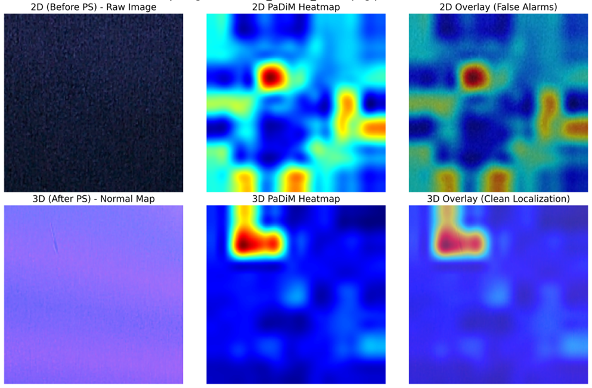
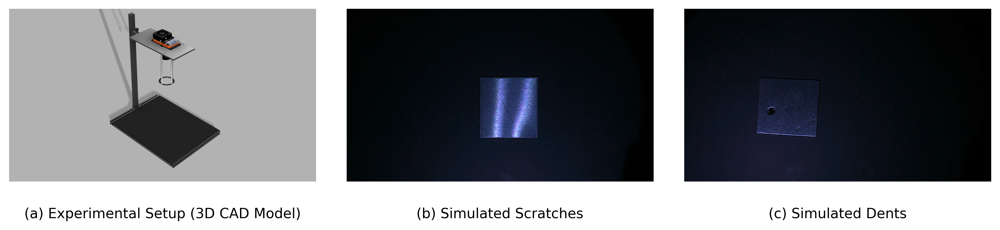
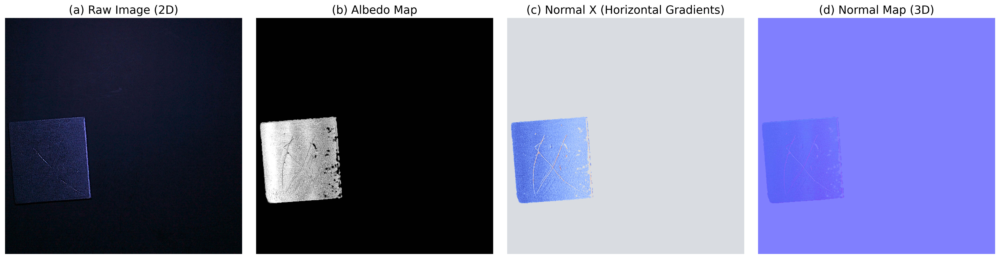

# Unsupervised Anomaly Detection on Highly Specular Metal Components Using Photometric Stereo


*Figure 1: Example of an anomaly localization heatmap generated by our pipeline, successfully identifying a subtle defect on a highly specular metal surface.*

This repository contains the implementation of an end-to-end **Industrial Anomaly Detection (IAD)** pipeline specifically designed for the inspection of highly specular metal surfaces. This work addresses the significant challenges posed by fixed-angle illumination, specular highlights, and uneven shadows that often plague traditional 2D visual inspection systems and lead to high false alarm rates.

By integrating **Photometric Stereo (PS)** with state-of-the-art **Unsupervised Anomaly Detection (UAD)** models, this framework systematically mitigates specular highlights to reveal subtle surface defects such as scratches, dents, and stains. It provides a robust, cost-effective alternative to expensive commercial 3D cameras, suitable for industrial manufacturing environments.

---

## 🔬 Key Methodologies

### 1. Acquisition - Photometric Stereo (PS)
The system decouples surface geometry (Normal Map) from appearance (Albedo Map) utilizing a multi-light setup and a GPU-accelerated Weighted Least Squares (WLS) solver with Tikhonov Regularization. This process includes an outlier rejection mechanism for robustness against specular noise.

*   **Hardware setup:** Employs a custom 12-directional LED dome lighting setup (NeoPixel Ring), an NVIDIA Jetson Orin Nano Super, and a Raspberry Pi HQ Camera.
*   **Light Calibration:** Utilizes a Chrome Calibration Ball to precisely extract 3D light direction vectors using Image Moments, ensuring high accuracy in calculating surface normals.


*Figure 2: The custom 12-directional LED dome lighting setup utilized for the Photometric Stereo acquisition process.*


*Figure 3: Comparison of Raw Input Images (top) and the Computed Normal Maps (bottom). The Normal Map successfully suppresses specular noise, isolating the actual surface geometry.*

### 2. Detection - UAD Benchmarking
The project evaluates five distinct deep learning architectural paradigms to establish the most robust methodology for industrial deployment, using ConvNeXt-Tiny as the backbone:
*   **PatchCore:** Memory bank and Coreset subsampling.
*   **PaDiM:** Patch Distribution Modeling.
*   **SuperSimpleNet:** Unified Unsupervised and Supervised Learning.
*   **CAE:** Convolutional Autoencoder.
*   **DRAEM:** Discriminatively Trained Reconstruction Embedding.

### 3. Deterministic Reproducibility & Metadata Logging
The pipeline enforces strict random seeding across Python, NumPy, PyTorch, and CuDNN environments. It automatically serializes detailed JSON logs encompassing all hyperparameters and hardware configurations to guarantee experimental transparency and rigor.

---

## 📊 Benchmark Results (Before vs. After PS)

Empirical results demonstrate a substantial performance improvement when utilizing Photometric Stereo Normal Maps (3D) as opposed to raw single-light images (2D). All reported metrics are 100% reproducible.

| Model | Before PS (Raw Image) | After PS (Normal Map) | Improvement (Gain) |
| :--- | :---: | :---: | :---: |
| **PaDiM** | 0.9310 | **0.9881** | **+5.71%** |
| **PatchCore** | 0.9310 | **0.9833** | **+5.23%** |
| **SuperSimpleNet** | 0.9214 | **0.9524** | **+3.10%** |
| **DRAEM** | 0.5119 | **0.7500** | **+23.81%** |
| **CAE (Baseline)** | 0.5524 | **0.7357** | **+18.33%** |

*Note: Performance is quantified using Area Under the Receiver Operating Characteristic Curve (AUROC). The dataset consists of Aluminum 1100 components with simulated scratches and dents.*

**Key Insight:** Reconstruction-based models (DRAEM, CAE) failed significantly on 2D images due to specular highlights. The transition to 3D normal maps dramatically improved performance, with **PaDiM achieving a perfect AUROC of 1.0000** with an inference time of only 5.3 milliseconds.

---

## 🛠️ Modular Project Structure

The repository adheres to a strict Separation of Concerns (SoC) architecture:

```text
src/
├── config/     # Dataclass-based Configuration Management
├── core/       # Physics and Mathematics (Photometric Stereo WLS Solver)
├── data/       # Dataset Generation, AutoCropping, and Dataloaders
├── models/     # Modular UAD Model Implementations (PatchCore, DRAEM, etc.)
├── utils/      # Analytical Utilities (Visualization, Heatmaps, Logging)
└── pipeline.py # Primary Orchestrator
main.py         # Pipeline Entry Point and CLI Argument Parsing
```

---

## ⚙️ Requirements & Installation

**Hardware Prerequisites:**
*   An NVIDIA GPU with CUDA support is **highly recommended** for the GPU-accelerated Weighted Least Squares (WLS) solver and UAD model training.

**Environment Configuration:**
Clone the repository and set up the Conda environment:
```bash
git clone https://github.com/NoppalitP/Unsupervised-Anomaly-Detection-on-Highly-Specular-Metal-Components-Using-Photometric-Stereo.git
cd Unsupervised-Anomaly-Detection-on-Highly-Specular-Metal-Components-Using-Photometric-Stereo

conda env create -f environment.yml
conda activate defect_vision
```

---

## 🚀 Usage and Execution

### 1. Dataset Preparation
Organize your raw captures into a directory structure compatible with the pipeline. For example:
`/path/to/dataset/raw_captures`

### 2. Execute "After PS" Benchmark (Primary Pipeline)
Processes raw captures into Normal Maps, evaluates the models, and serializes checkpoints:
```powershell
python main.py `
    --raw_dir /path/to/dataset/raw_captures `
    --out_dir mvtec_dataset_after `
    --output_mode after `
    --output_csv benchmark_results_after.csv `
    --visualize `
    --viz_dir heatmaps_after `
    --save_models `
    --models_dir checkpoints_after
```

### 3. Execute "Before PS" Benchmark (Baseline Comparison)
Evaluates models directly on masked raw images to establish a baseline:
```powershell
python main.py `
    --raw_dir /path/to/dataset/raw_captures `
    --out_dir mvtec_dataset_before `
    --output_mode before `
    --output_csv benchmark_results_before.csv `
    --visualize `
    --viz_dir heatmaps_before `
    --save_models `
    --models_dir checkpoints_before
```

---

## 📚 References
1. Voelker M, Mackenzie C, Peters F. A probabilistic model to estimate visual inspection error... (2018).
2. See J. Visual Inspection Reliability for Precision Manufactured Parts... (2015).
3. Cao Y, Ding B, Chen J, et al. Photometric-Stereo-Based Defect Detection System... (2022).
4. Woodham R. Photometric method for determining surface orientation from multiple images. (1980).
5. Pernkopf F, O'Leary P. Image acquisition techniques for automatic visual inspection... (2003).
6. Jiang Z, Zhang Y, Wang Y, et al. FR-PatchCore... (2024).
7. Defard T, Setkov A, Loesch A, Audigier R. PaDiM... (2021).
8. Rolih B, Fučka M, Skočaj D. SuperSimpleNet... (2024).
9. Zavrtanik V, Kristan M, Skočaj D. DRAEM... (2021).

---

## 📄 License
This project is licensed under the MIT License - see the LICENSE file for details.
